<div align="center">

# Controller Tester

**Test any gamepad in your browser. PS5 DualSense and DualSense Edge, PS4 DualShock 4, Xbox, and everything else the Gamepad API can see.**

No install. No account. Nothing uploaded.

[](https://github.com/hammadxcm/playstation-controller-tester/actions/workflows/deploy.yml)
[](CHANGELOG.md)
[](LICENSE)
[](CONTRIBUTING.md)
[](package.json)
[](package.json)
[](CONTRIBUTING.md)
[](#internationalisation)

**[Open the app](https://hammadxcm.github.io/playstation-controller-tester/)** · [Report a bug](https://github.com/hammadxcm/playstation-controller-tester/issues/new/choose) · [Changelog](CHANGELOG.md)

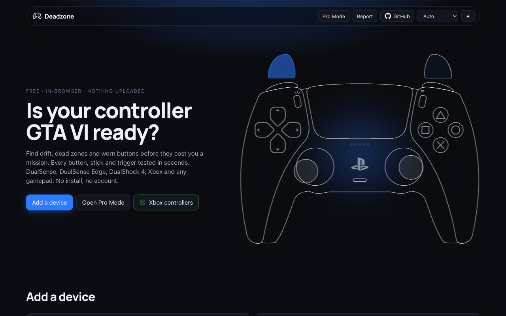

</div>

## Table of contents

- [Highlights](#highlights)
- [Screenshots](#screenshots)
- [Supported controllers](#supported-controllers)
- [Browser support](#browser-support)
- [Quick start](#quick-start)
- [How to use](#how-to-use)
- [Hardware test checklist](#hardware-test-checklist)
- [Privacy and security](#privacy-and-security)
- [Development](#development)
- [Architecture](#architecture)
- [Internationalisation](#internationalisation)
- [Contributing](#contributing)
- [Releases and versioning](#releases-and-versioning)
- [Credits and inspiration](#credits-and-inspiration)
- [License](#license)

## Highlights

- **Every controller, every browser.** Live drawing of the pad (accurate DualSense, Edge and DualShock 4 outlines; drawn Xbox and generic models) with pressed buttons, stick travel, trigger fill, lightbar, player LEDs, mic light and touch points.
- **Stick lab.** Glow trace, coverage ring, drift, circularity error, resolution bits, dead zone and fault badges.
- **Trigger and button labs.** Animated lever gauges, press counts, hold time, chatter and stuck-button detection, raw axes.
- **Rumble.** Dual-rumble and Xbox trigger-rumble with the model shaking.
- **Health check.** Six guided steps to a 0–100 score with a grade and JSON / PNG export.
- **Learn mapping.** Teach the app a pad the browser does not recognise.
- **Pro Mode over WebHID** (desktop Chrome / Edge, USB or Bluetooth). Adaptive triggers with engaged read-back, lightbar and rainbow, player and mic LEDs, touchpad, calibrated gyro and accelerometer, battery, firmware and factory data, controller audio, several pads side by side, and a HID console that logs every report.
- **PS5-style landing page.** Pointer-tilted hero render running an idle demo, an Add Device flow for both ways in, a showcase with hover callouts, and a tile for every screen. Crossfades into the app the moment a pad appears.
- **Light and dark, reduced motion, nine languages, keyboard-first.** Theme follows the OS with no flash, motion respects your preference, and the whole page works from the keyboard.
- **Private by construction.** Self-hosted fonts, a strict Content-Security-Policy, no analytics, no network calls after load.

## Screenshots

<table>
  <tr>
    <td align="center">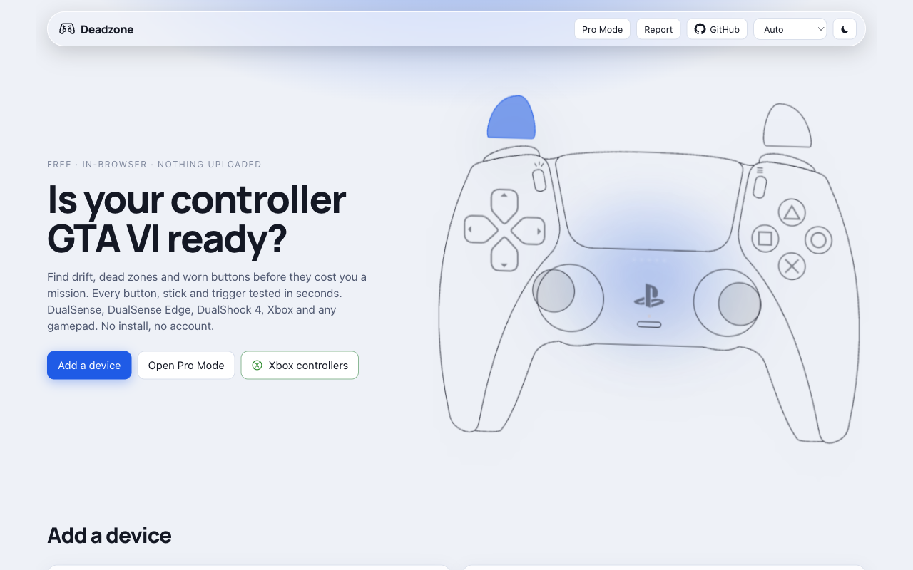<br><sub>Landing, light theme</sub></td>
    <td align="center">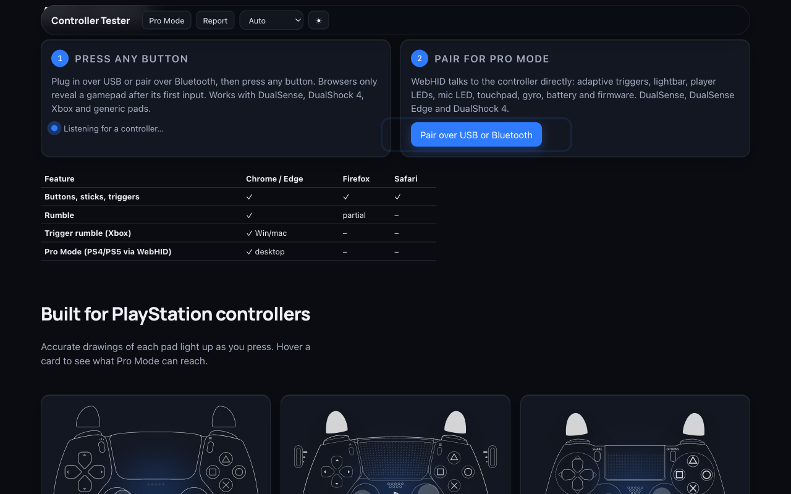<br><sub>Add a device: press any button, or pair over WebHID</sub></td>
  </tr>
  <tr>
    <td align="center">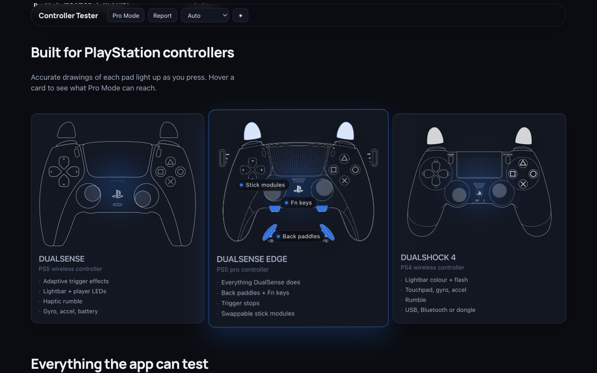<br><sub>Showcase: hover lights the real parts</sub></td>
    <td align="center">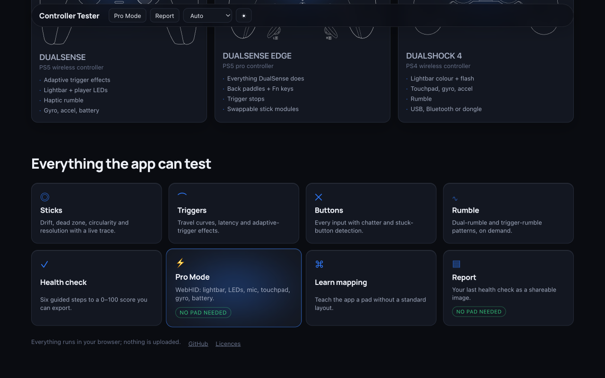<br><sub>Every screen, one tap away</sub></td>
  </tr>
  <tr>
    <td align="center">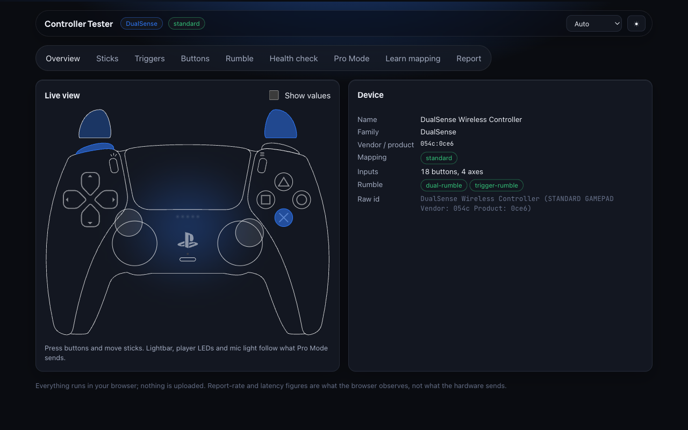<br><sub>Overview: live drawing and device details</sub></td>
    <td align="center">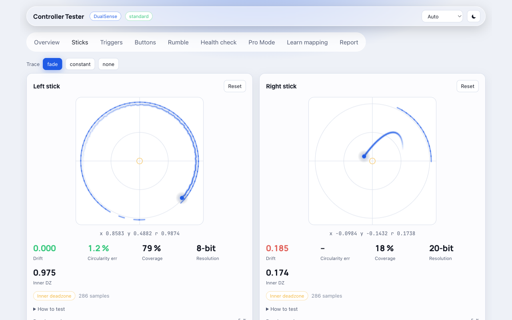<br><sub>Stick lab: trace, drift, circularity, resolution</sub></td>
  </tr>
  <tr>
    <td align="center">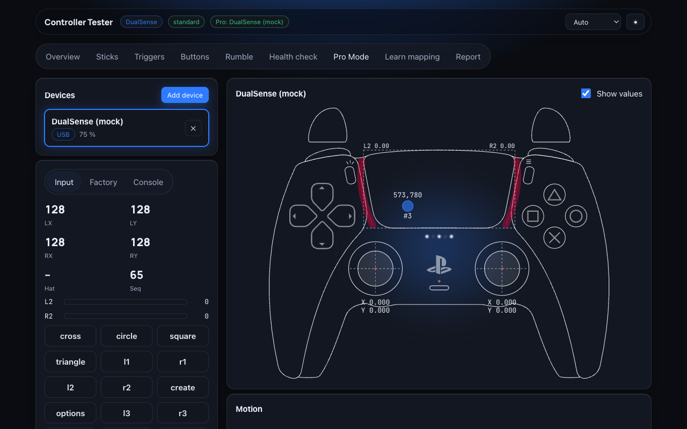<br><sub>Pro Mode: WebHID bench with touch points and show-values overlay</sub></td>
    <td align="center">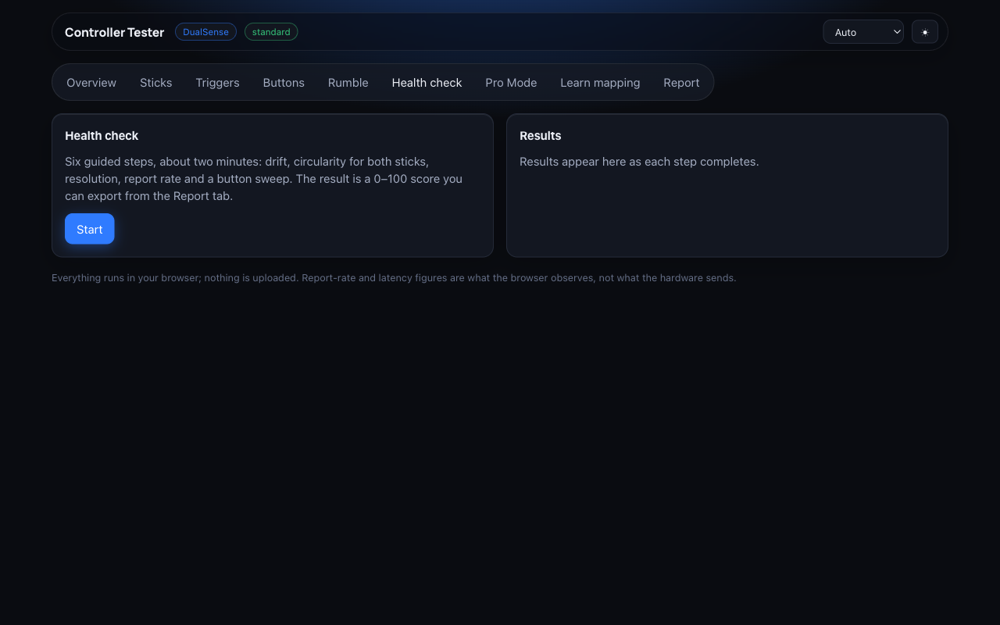<br><sub>Health check: six steps to a score</sub></td>
  </tr>
</table>

<p align="center">
  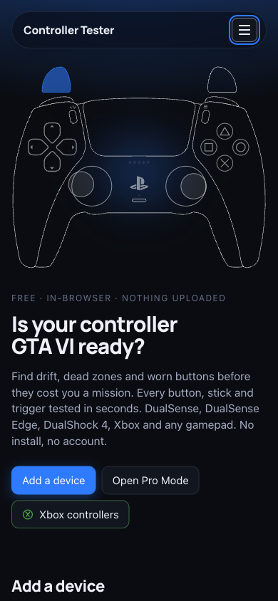
  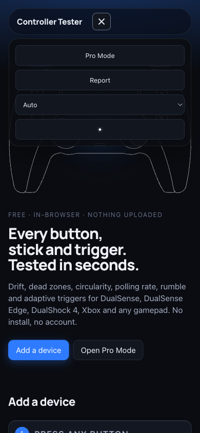
  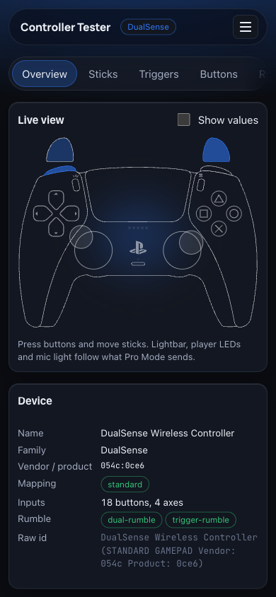
  <br><sub>Phone: landing, hamburger menu, Overview</sub>
</p>

## Supported controllers

Anything the browser exposes through the Gamepad API works on every screen except Pro Mode. Pro Mode talks to Sony pads directly over WebHID:

|                                                                                                 | DualSense / Edge | DualShock 4        |
| ----------------------------------------------------------------------------------------------- | ---------------- | ------------------ |
| Raw sticks, triggers, buttons, Edge Fn / paddles / profile                                      | ✓                | ✓ (no Edge fields) |
| Touchpad (two fingers, on the drawing)                                                          | ✓                | ✓                  |
| Gyro / accelerometer, factory calibration, 3D cube                                              | ✓                | ✓                  |
| Battery, charging, USB / headset flags                                                          | ✓                | ✓                  |
| Rumble over HID (works on Bluetooth)                                                            | ✓                | ✓                  |
| Lightbar, rainbow effect                                                                        | ✓                | ✓ + flash          |
| Player LEDs + brightness, mic LED                                                               | ✓                | –                  |
| Adaptive triggers (feedback, weapon, vibration, bow, galloping, machine) with engaged read-back | ✓                | –                  |
| Firmware / hardware version                                                                     | ✓                | –                  |
| Factory data (serial, PCBA id, MCU id, BT address, battery voltage, touchpad firmware)          | ✓                | –                  |
| Speaker / headphone tone and file playback, haptic channels, mic level meter (USB only)         | ✓                | –                  |
| Several controllers at once, side-by-side compare                                               | ✓                | ✓                  |
| HID console: every report sent / received with bytes and errors                                 | ✓                | ✓                  |

## Browser support

|                   | Chrome / Edge desktop   | Chrome Android | Firefox           | Safari            |
| ----------------- | ----------------------- | -------------- | ----------------- | ----------------- |
| Gamepad API       | ✓                       | ✓              | ✓ (no timestamps) | ✓ (no vendor ids) |
| dual-rumble       | ✓                       | ✓              | partial           | –                 |
| trigger-rumble    | ✓ Win / macOS, Linux BT | –              | –                 | –                 |
| Pro Mode (WebHID) | ✓                       | –              | –                 | –                 |
| Controller audio  | ✓ (USB)                 | –              | –                 | –                 |

Report-rate and latency figures are what the browser observes, not what the hardware sends. If Pro Mode finds nothing, close Steam, PS Remote Play, DS4Windows or reWASD: they take the HID reports first.

## Quick start

**Use it:** open **https://hammadxcm.github.io/playstation-controller-tester/**, plug in or pair a controller, press any button.

**Run it locally:**

```sh
git clone https://github.com/hammadxcm/playstation-controller-tester.git
cd playstation-controller-tester
pnpm install
pnpm dev        # http://localhost:5173/playstation-controller-tester/
```

Node 22 and pnpm 12 (`corepack enable` picks the pinned version). Chrome or Edge is needed for Pro Mode; everything else works in any modern browser.

## How to use

1. **Add a device.** The landing page listens for a controller. Plug in over USB or pair over Bluetooth, then press any button; browsers only reveal a gamepad after its first input. The page crossfades into the app.
2. **Pair for Pro Mode.** In Chrome or Edge, choose _Pair over USB or Bluetooth_ on the landing (or _Add device_ in Pro Mode) and pick the pad in the browser's device chooser. Bluetooth pads start in a reduced report mode; the app switches them to full reports automatically.
3. **Pick a screen.** Overview, Sticks, Triggers, Buttons, Rumble, Health check, Pro Mode, Learn mapping and Report. `#pro` and `#report` are deep links that need no pad.
4. **Theme and language** live in the top bar (a hamburger on phones). The theme follows your OS until you choose one; the language follows your browser until you choose one.

If Pro Mode finds nothing, close Steam, PS Remote Play, DS4Windows or reWASD: they take the HID reports first.

## Hardware test checklist

Open Pro Mode, add the controller, then for each item check the drawing reacts and the HID console shows no errors:

1. Lightbar colour, off, rainbow (DS4: flash on/off)
2. Player LEDs P1–P5 and brightness, mic LED off / on / pulse
3. Rumble strong / weak / both; the model shakes and the grips glow
4. Adaptive triggers: every mode on L2 and R2, "effect engaged" badge, release
5. Touchpad: two fingers appear on the drawing with ids and coordinates
6. Motion: cube follows tilt; gyro values are calibrated
7. Battery and charging state match the OS; Factory tab reads serial and firmware
8. Audio (USB): find the sound card, 440 Hz tone, file playback, haptic channels, mic meter

Anything that fails: Console tab → Copy, and paste the log into an issue.

## Privacy and security

Everything runs in your browser. The page is fully self-hosted (fonts included), contacts no third party, has no analytics, and stores only your preferences and learned button layouts in `localStorage`. Pro Mode can only reach a controller you pick in the browser's device chooser, and controller data never leaves the page. Audio tests ask for microphone permission solely so device names become visible; the stream is released immediately.

A strict Content-Security-Policy allows only same-origin scripts, fonts and connections; controller drawings are sanitised before rendering; the HID console redacts factory payloads such as serial numbers and Bluetooth addresses. Please report vulnerabilities privately as described in [SECURITY.md](SECURITY.md).

## Development

```sh
pnpm dev                # dev server with the mock harness
pnpm test               # vitest
pnpm test:coverage      # 100 % lines / branches / functions / statements enforced on the logic layers
pnpm typecheck && pnpm lint && pnpm build   # the CI gate
```

Headless UI checks use a mock harness that exists only in dev builds; production bundles do not contain it:

```
/?mock=dualsense&pose=all                       # families: dualsense dualshock4 xbox generic; poses: idle press-south sticks-diag triggers-half dpad-up all
/?mock=dualsense&anim=1                         # time-driven sweep
/?mock=dualsense&hid=1&lb=ff0044&leds=P3&mic=pulse&trig=left:weapon   # Pro Mode with a mock controller
/?mock=dualsense&hid=2                          # two mock controllers (DualSense + DualShock 4)
/?mock=xbox&theme=light&motion=reduce           # theme and reduced-motion overrides
/?mock=none&theme=dark                          # landing page (no fake pad) with the same overrides
/?mock=dualsense&hid=1&edge=1                   # mock WebHID pad reports as a DualSense Edge
/#pro   /#report                                # deep links straight into a screen (no pad needed)
```

`window.__ct` exposes `pose()`, `fx`, `hid`, `settle()` and `stats()` for scripted screenshots. The screenshots in this README were taken that way with Playwright.

## Architecture

| Layer   | Path                           | Notes                                                                                                                                             |
| ------- | ------------------------------ | ------------------------------------------------------------------------------------------------------------------------------------------------- |
| Core    | `src/core`                     | Framework-free: Gamepad helpers, WebHID drivers with a fake device for tests, factory command protocol, USB audio graph, analysis. 100 % covered. |
| State   | `src/state`                    | A small zustand store plus hooks. Hot-path frames never touch React state.                                                                        |
| Model   | `src/features/model`           | The rig that animates any drawing: pure frame diff → DOM attribute writes on one shared animation frame.                                          |
| Screens | `src/features/*`               | One folder per screen, each its own lazy chunk.                                                                                                   |
| Landing | `src/features/landing`         | Hero render layer, Add Device, showcase, feature tour.                                                                                            |
| i18n    | `src/i18n`                     | Typed dictionaries, prefix-matched language negotiation, `{var}` interpolation. No dependency.                                                    |
| Motion  | `src/lib/motion.ts` + `motion` | Shared reduced-motion source of truth, one rAF loop, Web Animations; Motion for React only for springs, presence and scroll values.               |

Deployed to GitHub Pages by [`deploy.yml`](.github/workflows/deploy.yml) on every push to `main`, after typecheck, lint, the coverage gate and a build. Pull requests run [`ci.yml`](.github/workflows/ci.yml) and get the build as a downloadable artifact; tags `vX.Y.Z` run [`release.yml`](.github/workflows/release.yml), which publishes a GitHub Release with notes from the changelog. See [RELEASING.md](RELEASING.md). Dependencies are pinned and updated by Dependabot; pnpm's release-age policy refuses packages younger than 24 hours.

## Internationalisation

The landing page, app chrome, empty states and both connect flows are available in English, Spanish, Portuguese, French, German, Russian, Japanese, Chinese and Korean. _Auto_ follows the browser; a choice persists. `<html lang>`, the title and the description follow the selected language. The tool screens stay English for now. Adding a language is a single file; see [CONTRIBUTING.md](CONTRIBUTING.md#adding-a-language).

## Contributing

Issues and pull requests are welcome. Read [CONTRIBUTING.md](CONTRIBUTING.md) for setup, the test gate and how to verify changes with and without hardware, and [CODE_OF_CONDUCT.md](CODE_OF_CONDUCT.md) for community expectations. Hardware problems have their own [issue template](https://github.com/hammadxcm/playstation-controller-tester/issues/new/choose) that asks for the Pro Mode console log. Changes are recorded in [CHANGELOG.md](CHANGELOG.md), which follows Keep a Changelog and semantic versioning.

## Releases and versioning

The project follows [Semantic Versioning](https://semver.org/) and [Keep a Changelog](https://keepachangelog.com/en/1.1.0/). Every version is a tag on `main`, a section in [CHANGELOG.md](CHANGELOG.md) and a [GitHub Release](https://github.com/hammadxcm/playstation-controller-tester/releases) with the built site attached; the running version is shown in the app footer. `main` deploys continuously; tags mark milestones. The process is in [RELEASING.md](RELEASING.md).

## Credits and inspiration

This project stands on other people's work. Thank you to:

- **[daidr/dualsense-tester](https://github.com/daidr/dualsense-tester)** by 戴兜 (Xuezhou Dai), live at [ds.daidr.me](https://ds.daidr.me). The idea of a browser-based DualSense, DualSense Edge and DualShock 4 tester over WebHID comes from here, and the accurate controller drawings used throughout this app are daidr's, under the MIT License.
- **[nondebug/dualsense](https://github.com/nondebug/dualsense)**: the clearest public write-up of the DualSense HID report layout, used as the reference for input parsing and output framing.
- **[Nielk1 (John Klein)](https://gist.github.com/Nielk1/6d54cc2c00d2201ccb8c2720ad7538db)**: TriggerEffectGenerator, the MIT-licensed factories for every DualSense adaptive-trigger effect. Our trigger effect bytes are a port of revision 6.
- **Linux `hid-playstation`** by Roderick Colenbrander and the kernel community, and **SDL's `SDL_hidapi_ps5.c` / `SDL_hidapi_ps4.c`** by Sam Lantinga and contributors: the reference implementations for Bluetooth CRC framing, calibration and feature reports. Read, not copied.
- **[nsfm/dualsense-ts](https://github.com/nsfm/dualsense-ts)**: a TypeScript-first DualSense interface that shaped how our controller API and capability flags are typed.
- **[imtumbleweed/ps5.js](https://github.com/imtumbleweed/ps5.js)**: a vanilla JavaScript recreation of the PS5 home screen that informed the landing page's motion language (tile focus scale, soft halos, restrained ease-out timing).
- **[Andy Merskin's parallax depth cards](https://codepen.io/andymerskin/full/XNMWvQ/)** and **[tilt.js](https://gijsroge.github.io/tilt.js/)** by Gijs Rogé: the pointer-tilt, layered-depth treatment behind the hero controller.

If you recognise your work here and want the credit worded differently, open an issue.

## License

Released under the [MIT License](LICENSE). Third-party notices, including the MIT-licensed controller drawings by Xuezhou Dai, are in [LICENSES.md](LICENSES.md).

"PlayStation", "DualSense", "DualShock" and "Xbox" are trademarks of their respective owners. This project is not affiliated with or endorsed by Sony Interactive Entertainment or Microsoft.
